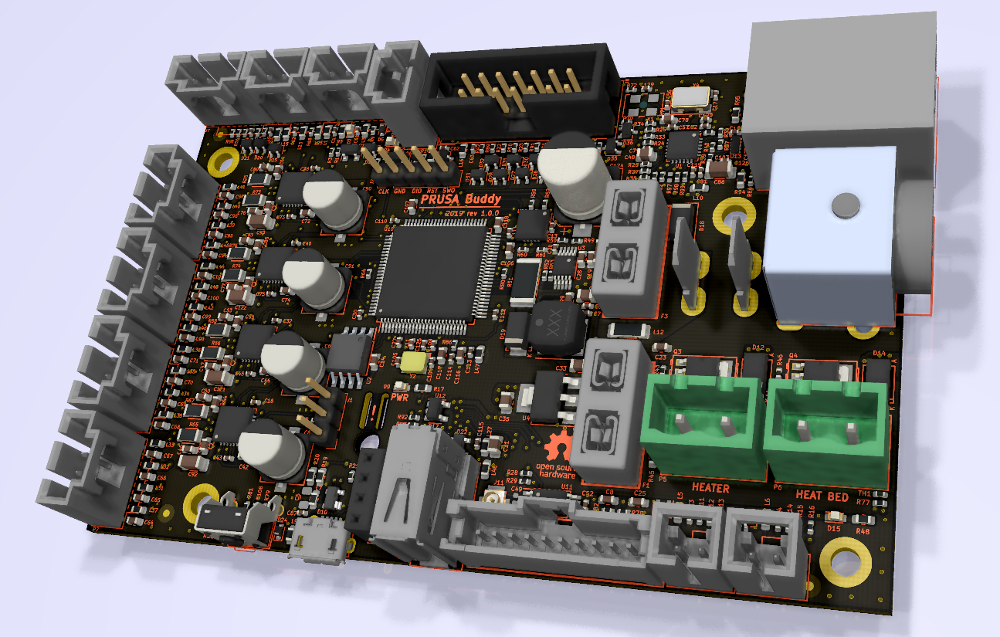

# Buddy-board-MINI-PCB

KiCad PCB layout

* [Interactive bom](http://htmlpreview.github.io/?https://github.com/prusa3d/Buddy-board-MINI-PCB/blob/master/rev.1.0.0/ibom.html)
* [STEP 3D model](rev.1.0.0/BUDDY_v1.0.0.step)
